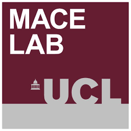

# UCL-RAP build history

## 2021-07-28
* Corrected URL link examples to a wordcloud image - direct link to raw files required.
* Guide to embedding wordclouds using Drupal

## 2021-05-21
* Specific word corrections can be made by appending to /tools/corrections/corrections.csv

## 2021-05-18
* Auto resizing to 600 px width. Height will vary.
* New sizing algorithm also considers relative width of characters.

## 2021-05-14
* Scrapped working repository at AdrianTimpson/UCL-RAP mirroring to UCL/RAP in favour of a single repository at UCL/RAP
* Automatic cropping of .png using imagemagick
* Cleared entire repository and started fresh, so will take several days before all wordclouds are regenerated

## 2021-05-12
* Refactored R scripts for speed ups
* Clouds now generated daily, but only for a small subset of UPIs and departments done (least recent). Therefore all UPIs and Depts are updated every few weeks.

## 2021-01-06
* New R script 'generate wordcloud for each department.R'. 
* New R script 'generate list of UPIs.R'.
* New R script 'generate list of department codes.R'.

## 2021-01-05
* New R script 'generate wordcloud for each UPI.R'. So far only researchers from GEE are included in the UPI lists. 

## 2021-01-04
* Initial creation

