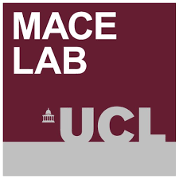

<a href="https://github.com/UCL"></a>
<a href="https://www.ucl.ac.uk/biosciences/departments/genetics-evolution-and-environment/research/molecular-and-cultural-evolution-lab"></a>

# UCL-RAP
## UCL Research Analysis Project

### Overview
Server automatically web scrapes keywords from UCL researcher profiles, analyses their frequency and similarities, generates wordclouds (for individuals, research groups and departments), and various summary statistics, graphics and timeseries of intra/inter group/departmental collaboration. This is a pilot project commissioned by UCL's Department of Genetics Evolution & Environment (GEE) Websites Review and Refresh Group 2020, chaired by Prof Mark Thomas. As such, the project is currently limited to GEE but is designed to provide a future proof and flexible legacy to assist other UCL departments. Collaboration and ideas are therefore most warmly welcomed. 

### Generating and accessing wordclouds
The server regulary automatically webscrapes publications from UCL Discovery, generates wordclouds, summary statistics etc, for any UPI with 5 or more publications and for departments with more than 10 publications.
UCL comprises several hundred departments and tens of thousands of UPIs, making this process computationally costly. Therefore, only the least recently updated 100 UPIs and 10 departments are updated each day.
Wordcloud images can be browsed in the 'wordclouds' folder, and directly embedded into any webpage (such as a departmental people page) using the github URL. For example:

```html
<a href="https://www.ucl.ac.uk"></a>
```

<a href="https://www.ucl.ac.uk"></a>

If required, word exclusions for a specific UPI can be placed in a .txt file in 'exclusions/individuals'.

### Current protocol
The following procedure is automatically performed daily (overnight) by the The Molecular And Cultural Evolution laboratory (MACE-lab) server using scripts in the R folder:
- Web scrape Discovery to update UPIs in /UPI/everyone.txt and /departments/departments.txt
- Web scrape research keywords from IRIS and Discovery for researchers in /everyone.txt, and keywords from Discovery for departments in /departments.txt.
- Combine keywords to form a frequency table for each UPI/group/department. Words from abstracts are weighted x1, titles are weighted x3, keywords are weighted x6, IRIS keywords are weighted x15.
- Various cleaning procedures, including truncation to the most frequent 350 words.
- Wordcloud images (.png) generated using wordcloud2 (R package) for each UPI and stored in the folder 'wordclouds'.

### Future work
The following weekly summary plots/statistics are not yet implemented:
- Wordclouds for research groups.
- Distance matrix (each UPI and each group/department) based on keyword frequencies.
- Distance matrix (each UPI and each group/department) based on coauthorship.
- Connectivity trees (both in terms of similarity of research, and coauthorship).

### Contact
- Adrian Timpson: a.timpson@ucl.ac.uk
- Mark G Thomas: m.thomas@ulc.ac.uk
- Richard Mott: r.mott@ucl.ac.uk

---